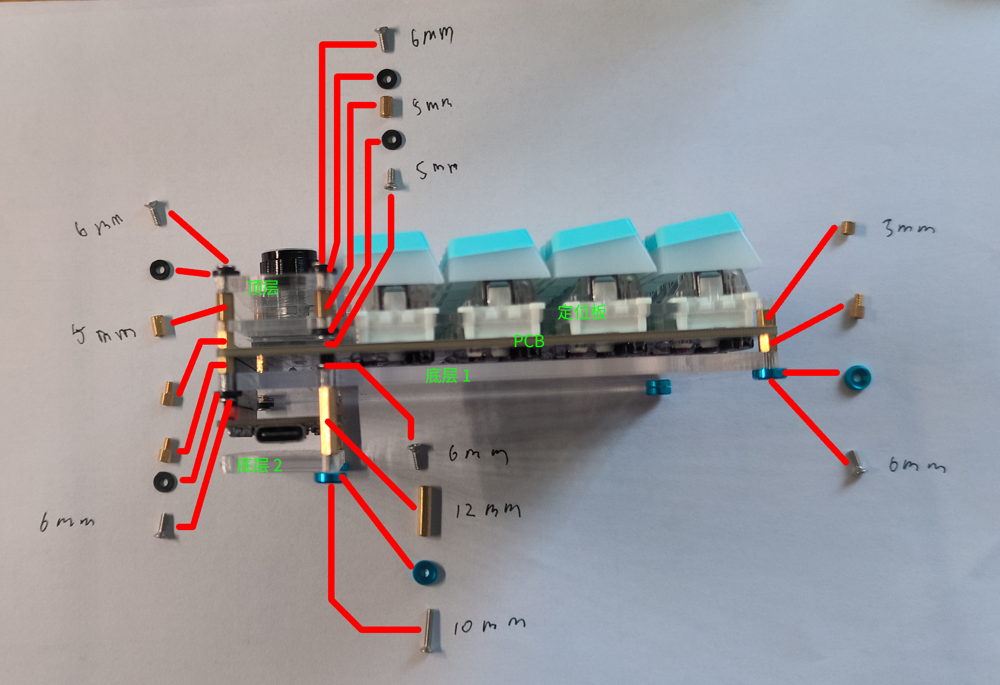

# calicocat-numpad

使用 树莓派 Pico 主控的数字键盘，带旋钮，带扩展接口。

使用 [kmk](https://github.com/KMKfw/kmk_firmware) 固件。

[硬件开源链接](https://oshwhub.com/calico-cat-3333/calicocat_numpad-v1)（打开提示不存在表明修改了但是还没审核完）

disptest.py 是外扩屏幕用的测试代码，尚未完成。

main.py 和 kb.py 是键盘的主要代码，可在 main.py 中修改键位布局。

boot.py 实现了默认禁用储存和串口，在插入键盘时按住左上角按键可以临时启用。

case 文件夹中是亚克力板切割设计文件，其中 switch.dxf 需要使用 2 mm 亚克力板，其他三个推荐 3 mm 亚克力板。

## 硬件组装

### 焊接

焊接需要 20 个轴座和 WS2812B 3528 反贴灯，21 个直插 1N4148 二极管，2 个 20 Pin 排母座，1 个 EC11 旋钮。

可选安装 1 个 8 Pin 排母或者 1 个 4 Pin 排母，用于后续安装屏幕，这两个排母推荐使用非标准的矮排母以降低高度。

焊接时，除 EC11 和 可选安装的排母在正面安装外，所有元件都需要在背面安装。

焊接二极管和 WS2812B 时需注意方向：二极管有黑色环的一端与丝印黑线在同侧；WS2812B GND 脚和正面均具有一个三角形切口，而板上 WS2812B 安装槽的一个角上同样具有三角形丝印，该丝印与三角形切口/ GND 脚在同一个角落，如安装正确，相邻两行的 WS2812B 的方向应该是相反的的。WS2812B有灯的一侧向上。

焊接二极管时推荐在背面焊接，焊接完成后，在正面近乎贴近板面的高度剪掉多余引脚，这么做是为了避免焊接引起的凸起阻碍后续安装。

RP2040 开发板可以使用官方树莓派或兼容板，我测试过官方树莓派 Pico 和 YD-RP2040 均可使用。开发板排针需向下焊接。

### 外壳组装

需要使用 M2 螺丝和螺柱，规格如下：

M2 螺丝，5 mm 长度 * 2

M2 螺丝，6 mm 长度 * 10

M2 螺丝，10 mm 长度 * 2

M2 3 mm 双通螺柱 * 2

M2 3 mm 单通螺柱 * 6

M2 12 mm 双通螺柱 * 2

M2 5 mm 双通螺柱 * 4

塑料垫片 * 8 （可选，目的是防止沉头螺丝压坏亚克力板，如果不用沉头螺丝也可以不用）

铝合金垫片 * 4（可选，目的是防止沉头螺丝压坏亚克力板，如果不用沉头螺丝也可以不用）

（这套配置是利用手头现有的零件组装的，可能不是最优选择，板材设计同样存在几个用不上的孔位）

板材有：

上盖 (top.dxf)

定位板 (switch.dxf)

PCB 板

底板 1 (bottom1.dxf)

底板 2 (bottom2.dxf)

PCB 板上侧两个孔均使用两个 3 mm 单通铜柱安装，螺丝一侧向上。

PCB 板下侧两个孔均使用一个 3 mm 单通铜柱 + 一个 3 mm 双通铜柱安装，其中单通铜柱在下，螺丝一侧向上穿过 PCB 上的孔，然后使用 3 mm 双通铜柱拧紧固定。

底板 1 中部两个孔均需要向下插入两个 6 mm 螺丝（注意方向），然后在下面使用 12 mm 双通螺柱拧紧固定，然后可以将底板 1 放在已经拧好螺柱的 PCB 板上，将较高的 20 Pin 排母座穿过预留的孔位，并在四个角上拧上 6 mm 螺丝固定，下侧的两个螺丝推荐增加铝合金垫片用作脚垫。上侧的螺丝可选安装塑料垫片。

底板 1 安装好后，将开发板插入排母座中（推荐先按照下方步骤安装 circuitpython 后再插入）。

底板 2 仅需将下侧的两个螺丝固定在 12 mm 双通铜柱上即可，推荐使用 10 mm 螺丝，并搭配铝合金垫片作为脚垫。底板 2 上侧的两个孔位在这套配置下不好安装，这里直接没有安装。

定位板层同样需要先在中部两个孔上，向上插入两个 5 mm 螺丝（注意方向，推荐加上塑料垫片），然后上面使用 5 mm 双通螺柱拧紧固定，然后推荐先将全部的轴体都插入，然后一次性全部插到轴座里去，否则因为亚克力板有弹性，很可能会装不上或者自己弹开。将较高的 EC 11 穿过预留的孔位，并将轴体全部插入到位后，上侧两个孔位应该穿过两个螺丝柱，将两个 5 mm 双通螺柱拧在上面。下侧的两个孔位由于加装螺丝后影响换轴所以没有装。

最后安装顶层（注意方向，不要卡住顶层的旋钮）然后在四个孔位拧上 6 mm 螺丝，推荐加上塑料垫片，不然很容易损坏亚克力板。

最后装上键帽和旋钮帽，组装完成。

## 安装固件

在开发板上安装 [circuitpython](https://circuitpython.org/):

按住 BOOT 按钮并将开发板插入电脑（对于 YD-RP2040 或其他具有 RST 按钮的开发板，也可以插入电脑后，按住 BOOT 按钮同时按一下 RST 按钮），此时可以看到电脑上提示插入新 USB 储存设备，然后松开 BOOT 按钮。

到 circuitpython 官网搜索对应开发板，并下载 uf2 文件。

将 uf2 文件复制到新出现的 USB 储存设备中，复制完成后，设备会自动断开完成刷写，随后会看到新的名为 CIRCUITPY 的 USB 储存设备插入，其中包含 code.py 等文件，即表明刷写完成。

删除 circuitpython 自带的 code.py

克隆 [kmk](https://github.com/KMKfw/kmk_firmware) 储存库，并将其中的 kmk 文件夹复制到 CIRCUITPY 储存器中。

将 [neopixel 库](https://github.com/adafruit/Adafruit_CircuitPython_NeoPixel/blob/main/neopixel.py)复制到在 CIRCUITPY 的 lib 文件夹中。

将 boot.py kb.py main.py 复制到 CIRCUITPY 储存器中。

拔下开发板/键盘，再次插入，此时不会再出现 CIRCUITPY 储存器，键盘应该可以正常使用。

如需修改代码、键位等，可以先将键盘拔下，按住左上角按键并重新插入电脑，此时即可看到 CIRCUITPY 存储器重新出现，此时可以松开按键，编辑代码，编辑过程中键盘将频繁重载以便测试，但是运行不稳定，推荐编辑完成后重新拔插键盘。